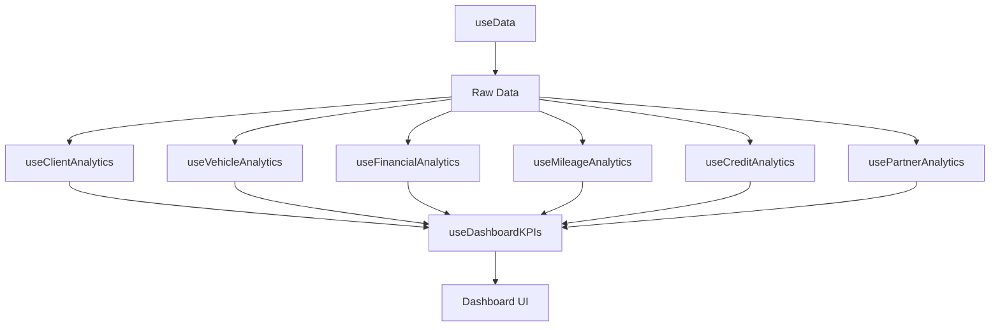

# Documentación de Estructura de KPIs

## Índice
1. [Descripción General](#descripción-general)
2. [Tipos de Datos](#tipos-de-datos)
3. [KPIs por Categoría](#kpis-por-categoría)
4. [Hooks de Analytics](#hooks-de-analytics)
5. [Flujo de Datos](#flujo-de-datos)

---

## Descripción General

El sistema de KPIs (Key Performance Indicators) de FleetEase Manager proporciona métricas en tiempo real sobre el estado de la flota, finanzas, clientes, socios y créditos.

### Arquitectura

```
Firestore Collections → Data Provider → Analytics Hooks → Dashboard KPIs Hook → Dashboard UI
```

---

## Tipos de Datos

### MetricKPIData

Estructura básica de un KPI:

```typescript
interface MetricKPIData {
  value: number | string;          // Valor principal del KPI
  loading: boolean;                 // Estado de carga
  changePercent?: number;           // Cambio porcentual (opcional)
  details?: any[];                  // Detalles para modales (opcional)
}
```

### KPIConfig

Configuración de un KPI en el dashboard:

```typescript
interface KPIConfig {
  id: string;                       // ID único del KPI
  label: string;                    // Etiqueta mostrada
  icon: LucideIcon;                 // Icono del KPI
  valueType: 'number' | 'currency' | 'percentage' | 'text';
  category: 'clients' | 'fleet' | 'finance' | 'credits' | 'partners' | 'mileage';
  isInteractive: boolean;           // Si abre modal al hacer clic
  description?: string;             // Descripción del KPI
}
```

---

## KPIs por Categoría

### 1. CLIENTES

#### `total-clients`
- **Valor**: Número de clientes activos
- **Cálculo**: `clients.filter(c => c.status === 'active' && !c.isDeleted).length`
- **Hook**: `useClientAnalytics`

#### `client-balance-total`
- **Valor**: Balance total de todos los clientes (en MXN)
- **Cálculo**: `Σ(initialBalance + totalIncome - totalPayments)`
- **Details**: Array de clientes con balance !== 0
- **Hook**: `useClientAnalytics`

#### `clients-with-debt`
- **Valor**: Número de clientes con deuda
- **Cálculo**: Clientes donde `currentBalance > 0`
- **Details**: Array de clientes con deuda
- **Hook**: `useClientAnalytics`

#### `critical-clients`
- **Valor**: Clientes con deuda > $6,000
- **Cálculo**: Clientes donde `currentBalance > 6000`
- **Details**: Array de clientes críticos
- **Hook**: `useClientAnalytics`

#### `licenses-expiring`
- **Valor**: Licencias que vencen en 30 días
- **Cálculo**: Clientes donde `daysUntilLicenseExpiry <= 30`
- **Details**: Array de clientes con licencia próxima a vencer
- **Hook**: `useClientAnalytics`

---

### 2. FLOTA

#### `total-vehicles`
- **Valor**: Total de vehículos operacionales
- **Cálculo**: `vehicles.filter(v => v.status !== 'sold' && !v.isDeleted).length`

#### `vehicles-rented`
- **Valor**: Vehículos actualmente rentados
- **Cálculo**: `vehicles.filter(v => v.status === 'rented').length`

#### `vehicles-available`
- **Valor**: Vehículos disponibles para renta
- **Cálculo**: `vehicles.filter(v => v.status === 'active').length`

#### `insurance-expiring`
- **Valor**: Seguros que vencen en 30 días
- **Cálculo**: Vehículos donde `insuranceExpiryDate - today <= 30 días`
- **Details**: Array de vehículos con seguro próximo a vencer
- **Hook**: Directo desde `vehicles`

#### `maintenance-overdue`
- **Valor**: Vehículos con mantenimiento vencido
- **Cálculo**: `kmToNextMaintenance <= 0`
- **Details**: Array de vehículos con mantenimiento vencido (incluye `currentMileage` y `nextMaintenanceAt`)
- **Hook**: `useMileageAnalytics`

#### `maintenance-needed`
- **Valor**: Vehículos que necesitan mantenimiento pronto (< 1500 km)
- **Cálculo**: `0 < kmToNextMaintenance <= 1500`
- **Details**: Array de vehículos con mantenimiento próximo
- **Hook**: `useMileageAnalytics`

#### `maintenance-soon`
- **Valor**: Igual que `maintenance-needed`
- **Hook**: `useMileageAnalytics`

---

### 3. FINANZAS

#### `income-month`
- **Valor**: Ingresos del mes (en MXN)
- **Cálculo**: `Σ(amount) WHERE type='income' AND date IN dateRange`
- **ChangePercent**: Comparación con mes anterior
- **Hook**: `useFinancialAnalytics`

#### `income-today`
- **Valor**: Ingresos del día actual
- **Cálculo**: `Σ(amount) WHERE type='income' AND date = today`
- **Hook**: `useFinancialAnalytics`

#### `expenses-month`
- **Valor**: Gastos del mes (en MXN)
- **Cálculo**: `Σ(amount) WHERE type='expense' AND date IN dateRange`
- **ChangePercent**: Comparación con mes anterior
- **Hook**: `useFinancialAnalytics`

#### `expenses-today`
- **Valor**: Gastos del día actual
- **Hook**: `useFinancialAnalytics`

#### `net-income`
- **Valor**: Ganancia neta (Ingresos - Gastos)
- **Cálculo**: `totalIncome - totalExpenses`
- **ChangePercent**: Comparación con mes anterior
- **Hook**: `useFinancialAnalytics`

#### `top-income-category`
- **Valor**: Categoría con más ingresos (texto)
- **Hook**: `useFinancialAnalytics`

#### `top-expense-category`
- **Valor**: Categoría con más gastos (texto)
- **Hook**: `useFinancialAnalytics`

---

### 4. CRÉDITOS

#### `active-credits`
- **Valor**: Número de créditos activos
- **Cálculo**: `credits.filter(c => c.status === 'active' && !c.isDeleted).length`
- **Details**: Array de créditos activos con información del cliente
- **Hook**: `useCreditAnalytics`

#### `overdue-credits`
- **Valor**: Créditos con retraso severo (> 4 semanas)
- **Cálculo**: Créditos donde `paymentBehavior === 'Retraso Severo'`
- **Details**: Array de créditos vencidos
- **Hook**: `useCreditAnalytics`

#### `recovery-rate`
- **Valor**: Tasa de recuperación (porcentaje)
- **Cálculo**: `((totalLent - totalRemaining) / totalLent) * 100`
- **Hook**: `useCreditAnalytics`

#### `total-lent`
- **Valor**: Total prestado (en MXN)
- **Cálculo**: `Σ(totalAmount) de créditos activos`
- **Hook**: `useCreditAnalytics`

#### `total-pending`
- **Valor**: Total pendiente de cobro (en MXN)
- **Cálculo**: `Σ(remainingBalance) de créditos activos`
- **Hook**: `useCreditAnalytics`

---

### 5. SOCIOS

#### `total-partners`
- **Valor**: Número de socios
- **Hook**: `usePartnerAnalytics`

#### `total-partner-balance`
- **Valor**: Balance total de socios (en MXN)
- **Cálculo**: `Σ(balance) de todos los socios`
- **Details**: Array de balances de socios
- **Hook**: Directo desde `partnerBalances`

#### `partners-positive-balance`
- **Valor**: Socios con balance positivo (se les debe)
- **Cálculo**: `partnerBalances.filter(pb => pb.balance > 0).length`
- **Hook**: Directo desde `partnerBalances`

#### `partners-negative-balance`
- **Valor**: Socios con balance negativo (deben)
- **Cálculo**: `partnerBalances.filter(pb => pb.balance < 0).length`
- **Hook**: Directo desde `partnerBalances`

---

### 6. KILOMETRAJE

#### `avg-fleet-mileage`
- **Valor**: Kilometraje promedio de la flota
- **Cálculo**: `Σ(currentMileage) / vehicleCount`
- **Hook**: `useVehicleAnalytics`

#### `high-mileage-vehicles`
- **Valor**: Vehículos con > 200,000 km
- **Cálculo**: `vehicles.filter(v => currentMileage > 200000).length`
- **Hook**: `useVehicleAnalytics`

#### `avg-daily-km`
- **Valor**: Promedio de km diarios de la flota
- **Cálculo**: `Σ(dailyAverageKm) / vehicleCount`
- **Hook**: `useVehicleAnalytics` / `useMileageAnalytics`

---

## Hooks de Analytics

### 1. `useClientAnalytics`

**Entrada**:
- `clients: Client[]`
- `financialRecords: FinancialRecord[]`
- `vehicles: Vehicle[]`

**Salida**: `ClientMetric[]`

**Métricas calculadas por cliente**:
```typescript
{
  clientId: string;
  totalIncome: number;
  totalPayments: number;
  currentBalance: number;
  paymentBehavior: 'Excelente' | 'Bueno' | 'Regular' | 'Malo' | 'Crítico';
  licenseStatus: 'Vigente' | 'Próxima a Vencer' | 'Vencida' | 'N/A';
  activityLevel: 'Alto' | 'Medio' | 'Bajo' | 'Inactivo';
  alerts: string[];
  recommendations: string[];
}
```

---

### 2. `useVehicleAnalytics`

**Entrada**:
- `vehicles: Vehicle[]`
- `financialRecords: FinancialRecord[]`
- `assignmentLogs: VehicleAssignmentLog[]`

**Salida**: `VehicleMetric[]`

**Métricas calculadas por vehículo**:
```typescript
{
  vehicleId: string;
  totalIncome: number;
  totalExpenses: number;
  netProfit: number;
  profitMargin: number;
  utilizationRate: number;
  maintenanceScore: number;
  performanceRating: 'Excelente' | 'Bueno' | 'Promedio' | 'Pobre' | 'Crítico';
}
```

---

### 3. `useFinancialAnalytics`

**Entrada**:
- `financialRecords: FinancialRecord[]`
- `clients: Client[]`
- `vehicles: Vehicle[]`
- `partners: Partner[]`
- `dateRange?: { from: Date, to: Date }`

**Salida**: `FinancialAnalytics`

**Métricas incluidas**:
- Totales de ingresos/gastos
- Análisis de crecimiento mensual
- Categorías de ingresos/gastos
- Top clientes y vehículos por rentabilidad
- Flujo de caja de últimos 12 meses

---

### 4. `useMileageAnalytics`

**Entrada**:
- `vehicles: Vehicle[]`
- `mileageLogs: MileageLog[]`
- `financialRecords: FinancialRecord[]`

**Salida**: `VehicleMileageMetric[]`

**Métricas calculadas**:
```typescript
{
  vehicleId: string;
  currentMileage: number;
  lastMaintenanceMileage: number;
  kmSinceLastMaintenance: number;
  nextMaintenanceDue: number;
  kmToNextMaintenance: number;
  estimatedMaintenanceDate: Date | null;
  dailyAverageKm: number;
  maintenanceScore: number; // 0-100
  alerts: string[];
}
```

---

### 5. `useCreditAnalytics`

**Entrada**:
- `credits: Credit[]`
- `clients: Client[]`
- `vehicles: Vehicle[]`
- `financialRecords: FinancialRecord[]`

**Salida**: `{ creditMetrics, portfolioAnalytics }`

**Métricas de crédito individual**:
```typescript
{
  creditId: string;
  totalAmount: number;
  paidAmount: number;
  remainingBalance: number;
  progressPercentage: number;
  paymentBehavior: 'Puntual' | 'Ligero Retraso' | 'Retraso Severo';
  weeksOverdue: number;
  alerts: string[];
  paymentDiscrepancy: boolean; // Validación cruzada
}
```

**Analytics del portafolio**:
```typescript
{
  totalPortfolioValue: number;
  totalPaid: number;
  totalRemaining: number;
  portfolioHealthScore: number; // 0-100
  behaviorDistribution: {
    puntual: number;
    ligeroRetraso: number;
    retrasoSevero: number;
  };
}
```

---

### 6. `usePartnerAnalytics`

**Entrada**:
- `partners: Partner[]`
- `vehicles: Vehicle[]`
- `financialRecords: FinancialRecord[]`

**Salida**: `PartnerMetric[]`

**Métricas por socio**:
```typescript
{
  partnerId: string;
  partnerName: string;
  vehicleCount: number;
  totalIncome: number;
  totalExpenses: number;
  netProfit: number;
  profitMargin: number;
  performanceLevel: 'Excelente' | 'Bueno' | 'Regular' | 'Bajo';
}
```

---

## Flujo de Datos

### 1. Carga Inicial


### 2. Procesamiento de Analytics



### 3. Actualización en Tiempo Real

1. Firestore detecta cambio → `onSnapshot`
2. DataProvider actualiza estado
3. Hooks de analytics recalculan métricas
4. `useDashboardKPIs` agrega datos
5. UI se re-renderiza automáticamente

---

## Convenciones de Nomenclatura

### IDs de KPIs
- Formato: `category-metric-name`
- Ejemplos:
  - `total-clients`
  - `vehicles-rented`
  - `income-month`
  - `maintenance-overdue`

### Categorías
- `clients`: Métricas de clientes
- `fleet`: Métricas de vehículos
- `finance`: Métricas financieras
- `credits`: Métricas de créditos
- `partners`: Métricas de socios
- `mileage`: Métricas de kilometraje

---

## Validación de Datos

### Reglas de Integridad

1. **Balances de Clientes**:
   - `currentBalance = initialBalance + totalIncome - totalPayments`

2. **Créditos**:
   - `remainingBalance = totalAmount - paidAmount`
   - Validación cruzada con `financialRecords` donde `creditPayment === true`

3. **Kilometraje**:
   - `kmToNextMaintenance = nextMaintenanceDue - currentMileage`
   - `nextMaintenanceDue = lastMaintenanceMileage + maintenanceInterval`

4. **Finanzas**:
   - `netProfit = totalIncome - totalExpenses`
   - `profitMargin = (netProfit / totalIncome) * 100`

---

## Optimización

### Caché y Memoización

Todos los hooks usan `useMemo` para evitar recálculos innecesarios:

```typescript
const metrics = useMemo(() => {
  // Cálculos pesados
  return calculatedMetrics;
}, [dependencies]);
```

### React Query

Los KPIs usan React Query para:
- Caché automático (5 minutos de staleTime)
- Refetch en background
- Optimistic updates

---

## Testing

Ubicación: `__tests__/hooks/`

Tests disponibles:
- `use-client-analytics.test.ts`
- `use-financial-analytics.test.ts`

Ejecutar tests:
```bash
npm run test           # Modo watch
npm run test:ci        # CI mode
npm run test:coverage  # Con cobertura
```

---

## Troubleshooting

### KPI muestra valor incorrecto

1. Verificar datos en Firestore
2. Revisar filtros en el hook de analytics
3. Confirmar que `dateRange` está configurado
4. Verificar que `isDeleted` se está filtrando correctamente

### Modal no muestra detalles

1. Verificar que el KPI tiene propiedad `details`
2. Confirmar que `isInteractive: true` en `AVAILABLE_KPIS`
3. Revisar que el modal está mapeado en `dashboard/page.tsx`

### Performance lento

1. Revisar número de documentos en Firestore
2. Considerar paginación para colecciones grandes
3. Agregar índices compuestos en Firestore
4. Aumentar `staleTime` en React Query

---

## Mantenimiento

### Agregar un nuevo KPI

1. Agregar cálculo en el hook de analytics correspondiente
2. Agregar KPI en `useDashboardKPIs`
3. Agregar configuración en `AVAILABLE_KPIS` (types/dashboard.ts)
4. Si es interactivo, agregar modal en `dashboard/page.tsx`
5. Actualizar esta documentación

### Modificar cálculo existente

1. Actualizar hook de analytics
2. Verificar que `useDashboardKPIs` está usando los datos correctos
3. Ejecutar tests: `npm run test`
4. Actualizar documentación si cambió la lógica

---

Última actualización: ${new Date().toISOString().split('T')[0]}
